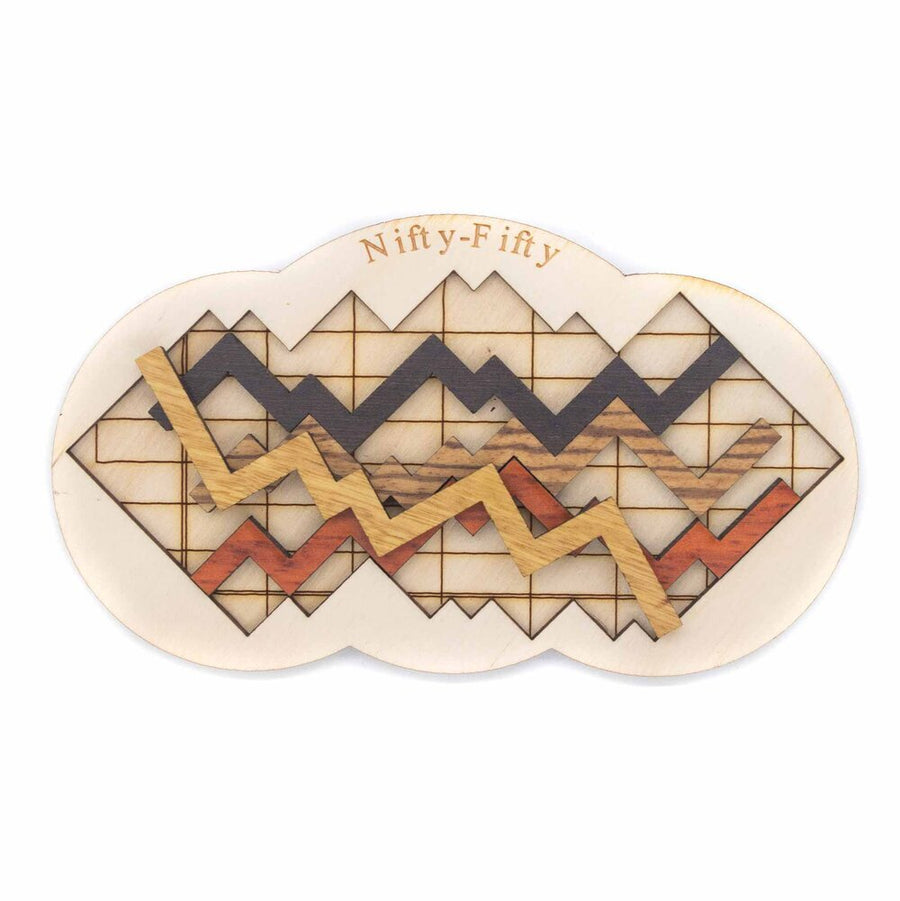
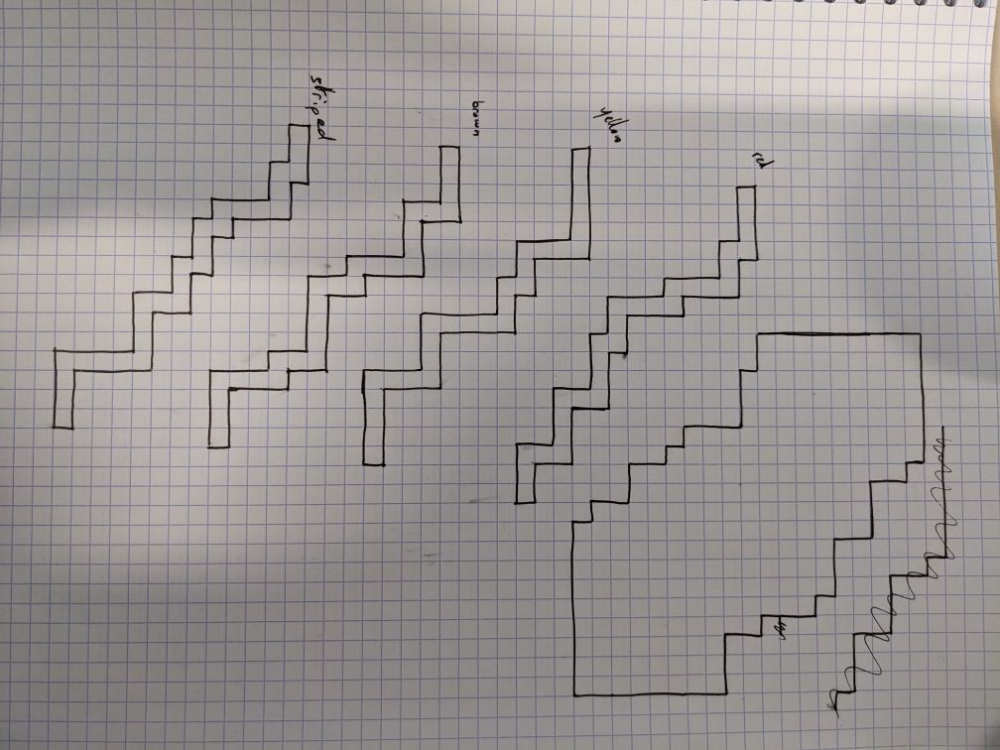

# Nifty Fifty resolver

## The puzzle 

This project is a python implementation for
solving the Nifty Fifty puzzle.

It consists in fitting 4 wooden pieces looking
like charts in a restricted area. There is only 
one solution.



## Modeling the puzzle 

Each chart can be represented as a sequence of 
segments of discrete length, articulated with 
each other on right angles.

The restricted area is represented as a 2 dimensinal 
plan with discrete coordinates.

The following sketch illustrates the model.
A square irepresents a (x,y) unit



## Implementation 

The charts are represented as a series of their points 
in a 2 dimensional array variable.

Each chart variable is named after its color:

- red
- yellow
- brown
- stripped

The available space is represented as a 2 dimensional 
array stored in the [grid.txt text file](grid.txt), as 
follows:

```
.......############
........###########
........###########
...........########
...........########
..............#####
...............####
...............####
...............####
##..............###
#####...........###
#####..............
#####..............
######.............
#######............
#######............
#########..........
#########..........
##########.........


# = unavailable space
. = available space
```

[The algorithm](nifty.py) consists in bruteforcing all the possible
combinations until the 4 charts fit in the area.


